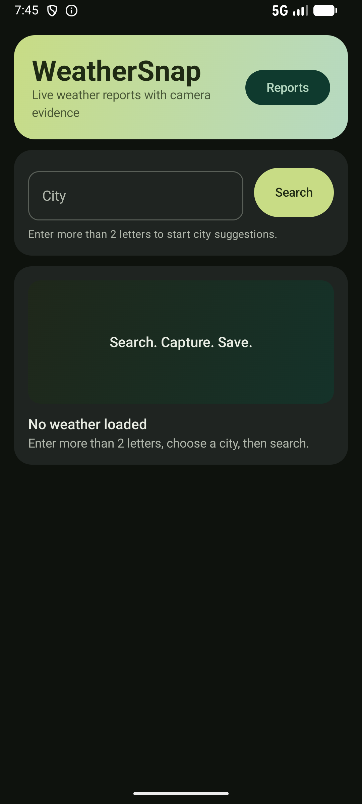
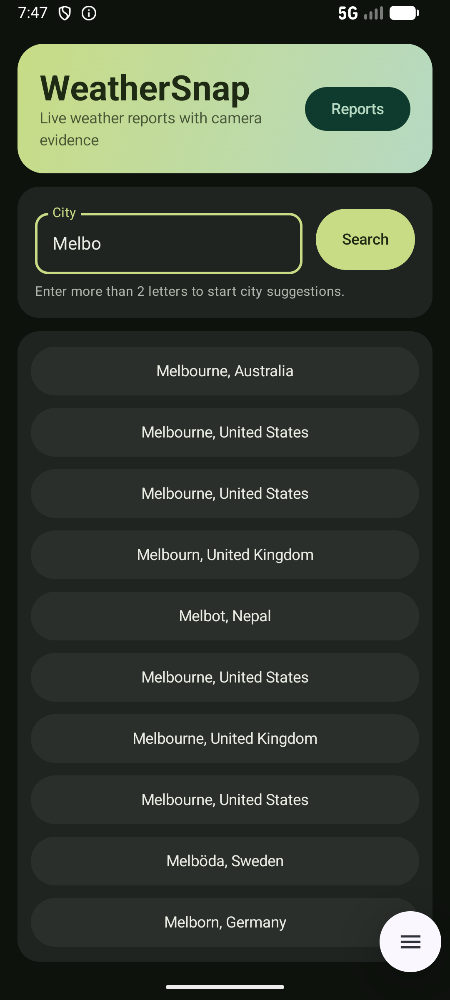
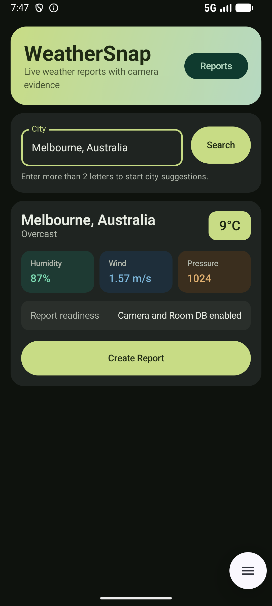
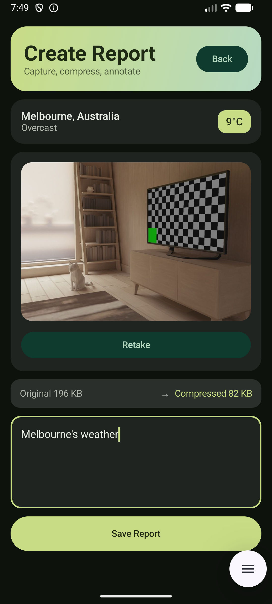
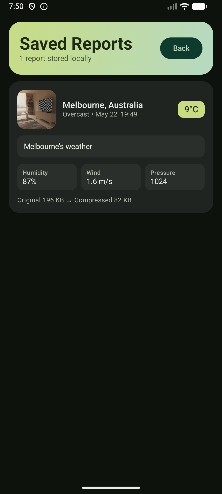

## WeatherSnap

An Android app that fetches live weather for a city, captures a photo with a custom CameraX camera, compresses it, and saves the report locally with notes. Built as a complete reference implementation of a modern, single-activity, Compose-first Android architecture.

### Screens

| Home | Search | Weather |
|:---:|:---:|:---:|
|  |  |  |

| Create Report | Saved Reports |
|:---:|:---:|
|  |  |

### Features

- **City autocomplete** — debounced search (300 ms) over Open-Meteo geocoding with an in-memory LRU cache.
- **Live weather** — temperature, condition, humidity, wind, pressure from Open-Meteo (no API key).
- **Custom camera** — full-screen CameraX preview + capture (no system intent), EXIF-correct rotation.
- **Image compression** — JPEG re-encoded at quality 80 with `inSampleSize` downsampling to ≤ 1080 px; "Original X KB → Compressed Y KB" displayed.
- **Persistent reports** — Room database, reactive list via `Flow`, image stored in `filesDir/reports/`.
- **Survives rotation and process death** — draft row is persisted to Room on first capture; `SavedStateHandle` holds the weather snapshot, draft id, and notes; Save is an idempotent `UPDATE` (no duplicate reports).

### Tech stack

Kotlin · Jetpack Compose · Material 3 · MVVM · ViewModel · StateFlow · Coroutines · Hilt · Navigation Compose · Retrofit + Gson · OkHttp logging · Room · CameraX · Coil.

### Architecture

```
app/
  data/
    image/        ImageCompressor (BitmapFactory + EXIF + JPEG)
    local/        Room entity, DAO, database, mappers
    remote/       Retrofit API, DTOs, mappers, WMO code mapping
    repository/   WeatherRepository, ReportRepository
  domain/model/   City, Weather, Report (pure Kotlin)
  di/             Hilt modules (Network, Database)
  navigation/     Routes, NavHost
  ui/
    weather/      search + current weather
    camera/       CameraX preview + capture
    report/       create/edit + draft persistence
    savedreports/ list of saved reports
    theme/        Material 3 dark theme
```

Single source of truth per screen: `ViewModel` exposes a `StateFlow<UiState>`, the composable collects it with `collectAsStateWithLifecycle`. Repositories return `Result<T>` for railway error handling.

### Notable design decisions

- **Two-flow search input** — display text and API trigger are separate flows, so picking a suggestion doesn't re-run the search.
- **Draft-backed Create Report** — captured + compressed image is persisted as a `STATUS_DRAFT` row immediately. Save flips it to `STATUS_SAVED` via `UPDATE`. Process death between capture and save resumes the same row; double-save is a no-op.
- **Weather snapshot in nav args** — the Weather object is JSON-encoded into the route, lands in `SavedStateHandle`, and survives process death.
- **EXIF rotation in compressor** — `BitmapFactory` drops EXIF; we read `TAG_ORIENTATION` and apply a `Matrix.postRotate` before re-encoding so portrait captures stay portrait.

### Setup

1. Open in Android Studio (Ladybug or newer) and let Gradle sync.
2. Run on a device or emulator with Android 7.0 (API 24)+.
3. Grant the camera permission on first capture.

No API key required.

### API

Open-Meteo:
- Geocoding: `https://geocoding-api.open-meteo.com/v1/search`
- Forecast: `https://api.open-meteo.com/v1/forecast`
